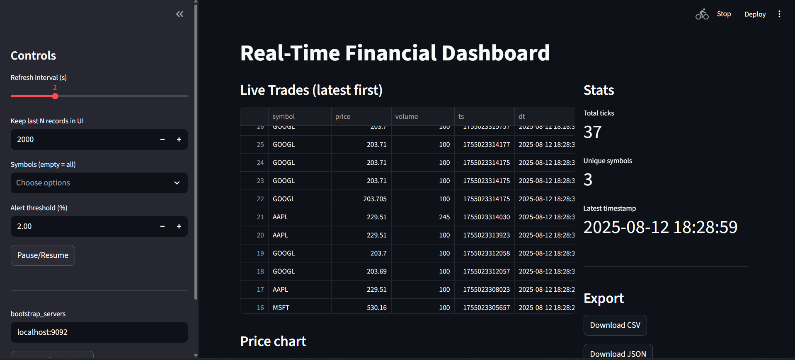
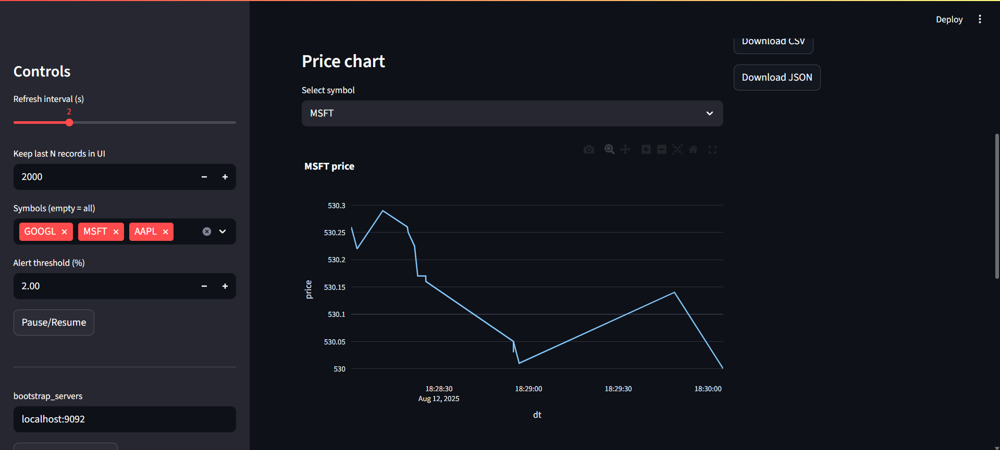
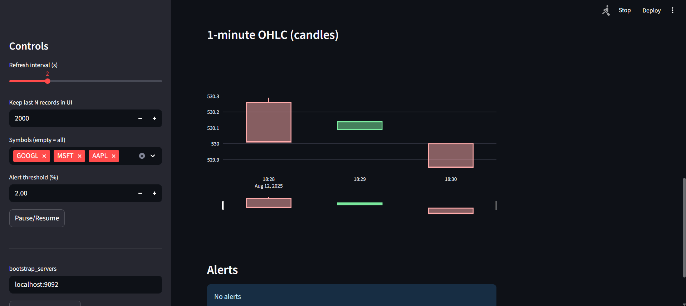
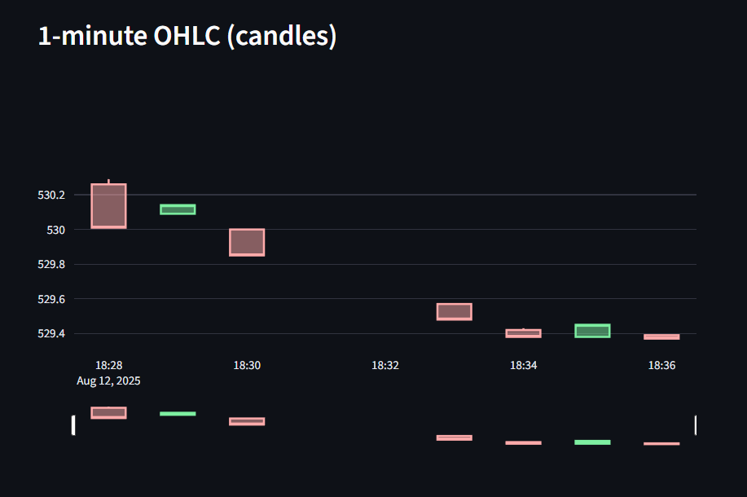
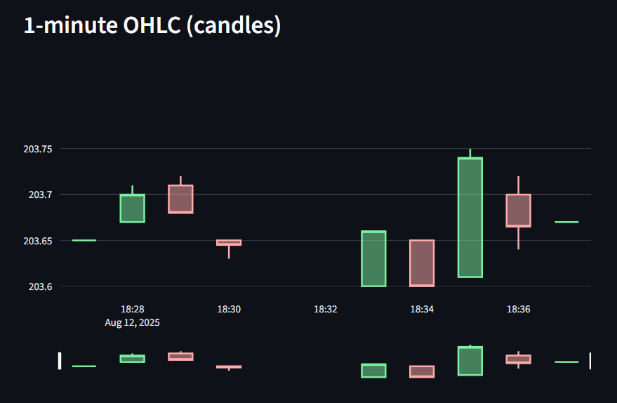
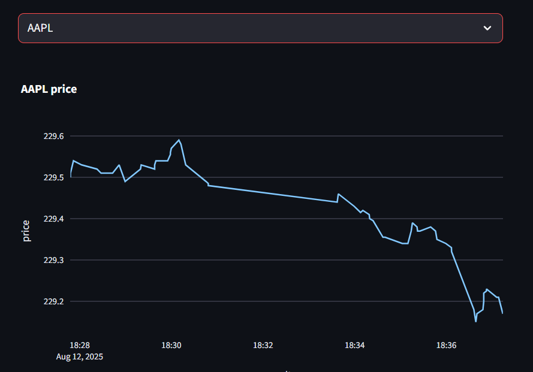
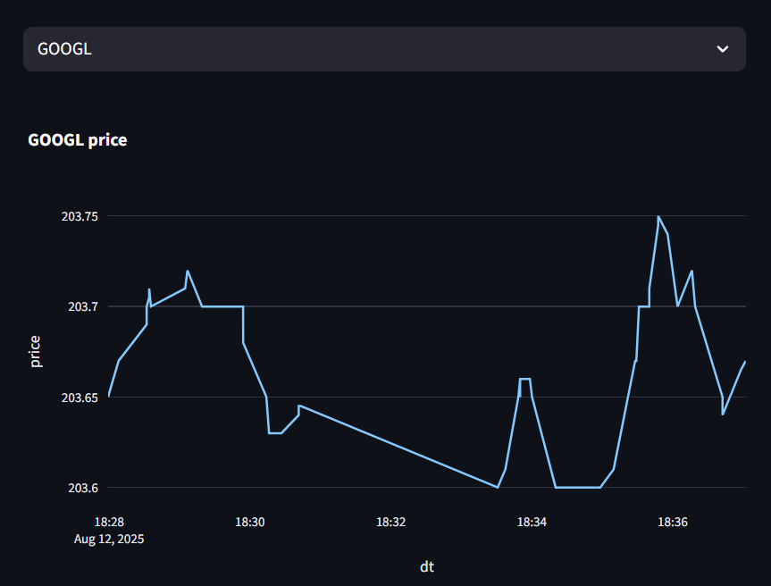
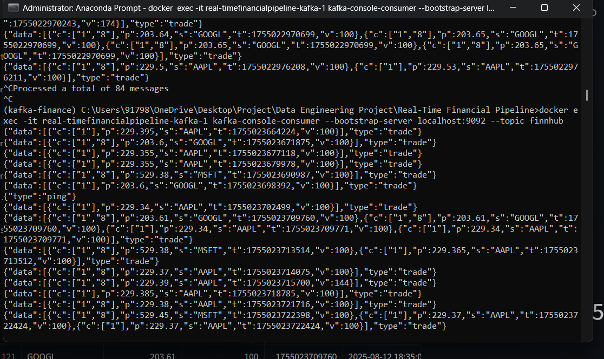
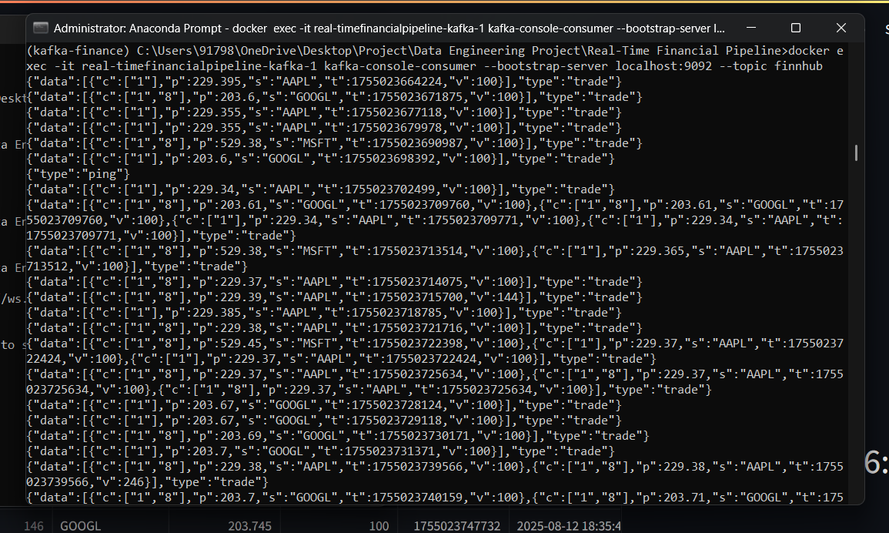
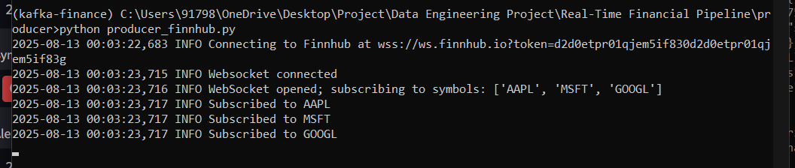

# 📈 Real-Time Financial Data Pipeline with Kafka & Streamlit

A comprehensive real-time stock trade monitoring pipeline that streams live market data from **Finnhub WebSocket API**, processes it through **Apache Kafka**, and visualizes insights through an interactive **Streamlit dashboard**.

## 🚀 Features

- **Live Trade Data Feed** from Finnhub.io WebSocket API
- **Kafka Producer** streams real-time stock trade ticks to Kafka topics
- **Kafka Consumer** processes messages for dashboard display
- **Interactive Streamlit Dashboard** with:
  - Live trade table with real-time updates
  - Price line charts for multiple symbols
  - 1-minute OHLC candlestick charts
  - Price change alerts and notifications
  - Data export functionality (CSV, JSON, PDF)
- **Custom Controls**:
  - Symbol filtering and selection
  - Adjustable refresh rates
  - Pause/Resume streaming controls
  - Configurable alert thresholds

## 📁 Project Structure

```
Real-Time Financial Pipeline/
├── connectors/                          # Kafka Connect configurations
│   ├── file-sink.json                  # File sink connector
│   └── jdbc-sink-postgres.json         # PostgreSQL sink connector
├── downloads/                           # Sample data files
│   ├── trades.csv                      # CSV trade data
│   └── trades.json                     # JSON trade data
├── frontend/                           # Streamlit dashboard
│   ├── kafka_consumer.py              # Kafka consumer for dashboard
│   ├── streamlit_app.py               # Main Streamlit application
│   └── __pycache__/                   # Python cache files
├── grafana/                           # Monitoring dashboards
│   └── dashboard_sample.json          # Grafana dashboard configuration
├── ksql/                              # KSQL queries
│   └── queries.sql                    # KSQL stream processing queries
├── producer/                          # Data producers
│   ├── producer_finnhub.py           # Finnhub WebSocket producer
│   ├── utils.py                      # Utility functions
│   └── t.py                          # Test scripts
├── schemas/                           # Avro schemas
│   └── trade_tick.avsc               # Trade data schema
├── scripts/                          # Utility scripts
│   └── create_topics.sh              # Kafka topic creation script
├── .env                              # Environment variables
├── docker-compose.yml                # Docker services configuration
├── requirements.txt                  # Python dependencies
└── README.md                         # This file
```

## 🛠️ Tech Stack

- **Data Source**: Finnhub WebSocket API
- **Message Queue**: Apache Kafka
- **Processing**: Python (confluent_kafka, websocket-client, pandas)
- **Visualization**: Streamlit + Plotly
- **Deployment**: Docker Compose
- **Monitoring**: Grafana
- **Database**: PostgreSQL (optional)

## 📋 Prerequisites

- **Docker & Docker Compose**
- **Python 3.9+**
- **Finnhub API Key** (Get free from [finnhub.io](https://finnhub.io))
- Basic understanding of Kafka & WebSocket

## 🚀 Installation & Setup

### 1. Clone the Repository

```bash
git clone https://github.com/nagakoushik24/Real-Time-Financial-Data-Pipeline-with-Kafka---Streamlit.git
cd Real-Time-Financial-Data-Pipeline-with-Kafka---Streamlit
```

### 2. Environment Configuration

Create a `.env` file in the project root:

```bash
# Finnhub API Configuration
FINNHUB_KEY=your_finnhub_api_key_here

# Kafka Configuration
KAFKA_BROKER=localhost:9092
KAFKA_TOPIC=finnhub

# Stock Symbols to Monitor
SYMBOLS=AAPL,MSFT,GOOGL,TSLA,NFLX
```

### 3. Install Dependencies

```bash
pip install -r requirements.txt
```

### 4. Start Infrastructure with Docker

```bash
# Start all services (Kafka, Zookeeper, Schema Registry, etc.)
docker-compose up -d

# Verify services are running
docker-compose ps
```

### 5. Create Kafka Topics

```bash
# Create the main topic for trade data
docker exec -it real-timefinancialpipeline-kafka-1 \
  kafka-topics --create --topic finnhub \
  --bootstrap-server localhost:9092 --partitions 1 --replication-factor 1

# Verify topic creation
docker exec -it real-timefinancialpipeline-kafka-1 \
  kafka-topics --list --bootstrap-server localhost:9092
```

## 🎯 Usage

### 1. Start the Data Producer

```bash
# Activate your Python environment
conda activate kafka-finance  # or your preferred environment

# Start the Finnhub data producer
python producer/producer_finnhub.py
```

### 2. Start the Streamlit Dashboard

```bash
# In a new terminal window
streamlit run frontend/streamlit_app.py
```

**Access the dashboard at:** [http://localhost:8501](http://localhost:8501)

### 3. Monitor Kafka Messages (Optional)

```bash
# View real-time messages
docker exec -it real-timefinancialpipeline-kafka-1 \
  kafka-console-consumer --bootstrap-server localhost:9092 --topic finnhub

# View all historical messages
docker exec -it real-timefinancialpipeline-kafka-1 \
  kafka-console-consumer --bootstrap-server localhost:9092 --topic finnhub --from-beginning
```

## 📊 Dashboard Features

### Live Trading Dashboard
- **Real-time Trade Table**: View latest trades with timestamps
- **Price Charts**: Interactive line charts for selected symbols
- **OHLC Candlesticks**: 1-minute aggregated candlestick charts
- **Volume Analysis**: Trade volume visualization
- **Price Alerts**: Configurable price change notifications

### Controls & Filters
- **Symbol Selection**: Choose which stocks to monitor
- **Refresh Rate**: Adjust data update frequency (1-60 seconds)
- **Pause/Resume**: Control data streaming
- **Alert Threshold**: Set price change alert limits
- **Data Export**: Download data as CSV, JSON, or PDF

## 🔧 Configuration

### Environment Variables

| Variable | Description | Default |
|----------|-------------|---------|
| `FINNHUB_KEY` | Finnhub API key | Required |
| `KAFKA_BROKER` | Kafka broker address | localhost:9092 |
| `KAFKA_TOPIC` | Kafka topic name | finnhub |
| `SYMBOLS` | Comma-separated stock symbols | AAPL,MSFT,GOOGL |

### Docker Services

| Service | Port | Description |
|---------|------|-------------|
| Kafka | 9092 | Message broker |
| Zookeeper | 2181 | Kafka coordination |
| Schema Registry | 8081 | Avro schema management |
| Kafka Connect | 8083 | Data connectors |
| KSQL Server | 8088 | Stream processing |
| Grafana | 3000 | Monitoring dashboard |
| PostgreSQL | 5432 | Database (optional) |


   ```bash
   # Check if Finnhub API key is valid
   curl "https://finnhub.io/api/v1/quote?symbol=AAPL&token=YOUR_API_KEY"
   ```

   ```bash
   docker-compose ps kafka
   
   # Check Kafka logs
   docker-compose logs kafka
   ```

   ```bash
   # Verify producer is sending data
   docker exec -it real-timefinancialpipeline-kafka-1 \
     kafka-console-consumer --bootstrap-server localhost:9092 --topic finnhub --from-beginning
   ```

### Performance Optimization

- **Increase Kafka partitions** for higher throughput
- **Adjust consumer group settings** for parallel processing
- **Configure JVM heap size** for large datasets
- **Use compression** for message serialization

## 📈 Monitoring & Analytics

### Grafana Dashboard
Access monitoring at [http://localhost:3000](http://localhost:3000)
- Default credentials: admin/grafana
- Pre-configured dashboards for Kafka metrics
- Real-time performance monitoring

### KSQL Queries
```sql
-- Create a stream from the finnhub topic
CREATE STREAM trade_stream (
    symbol VARCHAR,
    price DOUBLE,
    volume BIGINT,
    timestamp BIGINT
) WITH (
    KAFKA_TOPIC='finnhub',
    VALUE_FORMAT='JSON'
);

-- Calculate average price by symbol
SELECT symbol, AVG(price) as avg_price
FROM trade_stream
GROUP BY symbol;
```

## 🤝 Contributing

1. Fork the repository
2. Create a feature branch (`git checkout -b feature/amazing-feature`)
3. Commit your changes (`git commit -m 'Add some amazing feature'`)
4. Push to the branch (`git push origin feature/amazing-feature`)
5. Open a Pull Request

## 📄 License

This project is licensed under the MIT License - see the [LICENSE](LICENSE) file for details.

## 🙏 Acknowledgments

- [Finnhub.io](https://finnhub.io) for providing free financial data API
- [Apache Kafka](https://kafka.apache.org/) for real-time data streaming
- [Streamlit](https://streamlit.io/) for the interactive dashboard
- [Confluent](https://www.confluent.io/) for Kafka ecosystem tools

## Screenshoots












