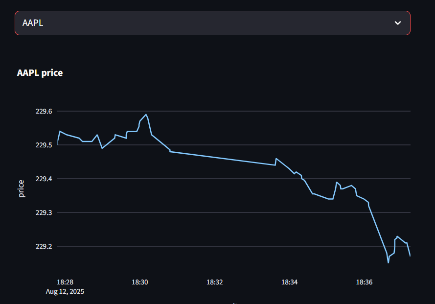
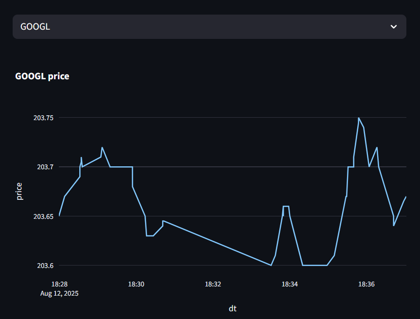
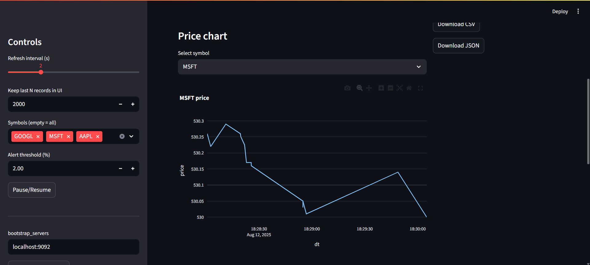
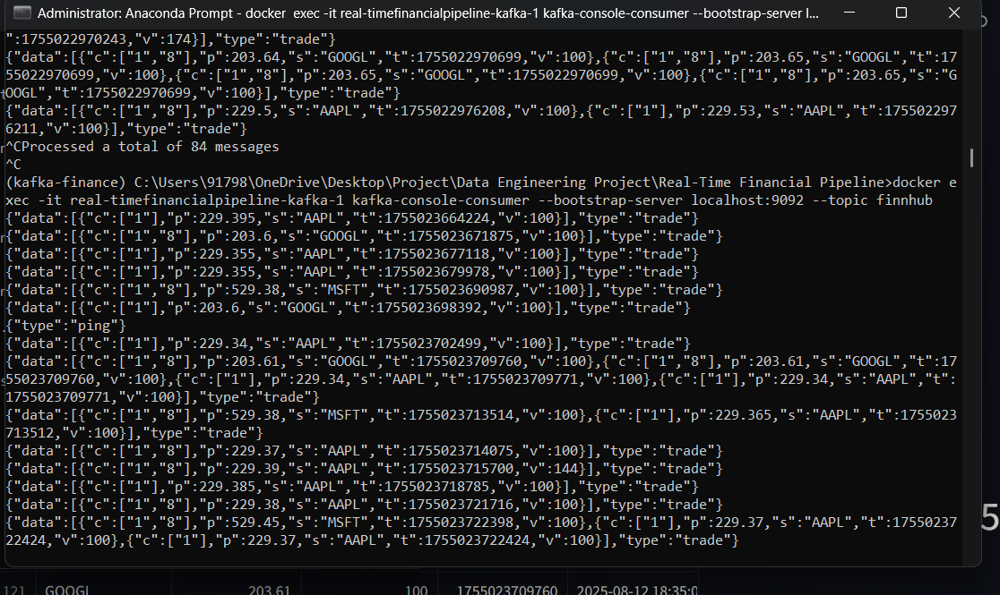
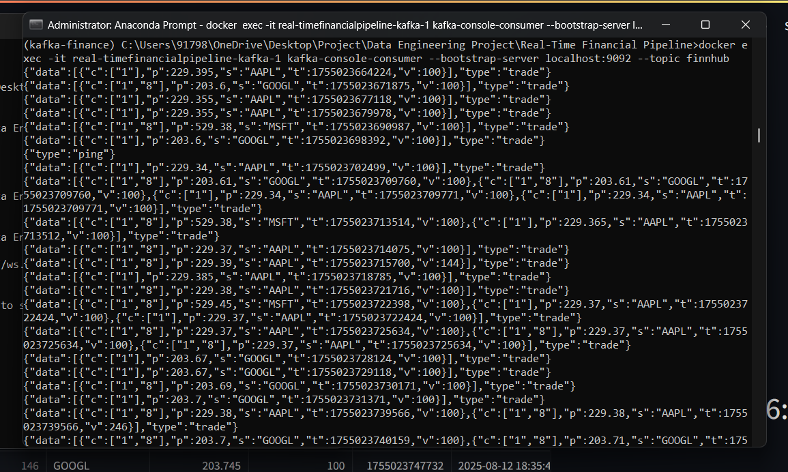
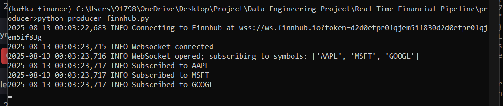
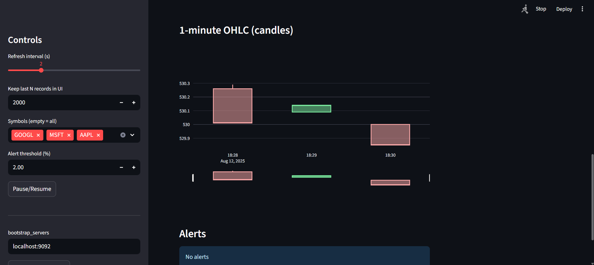
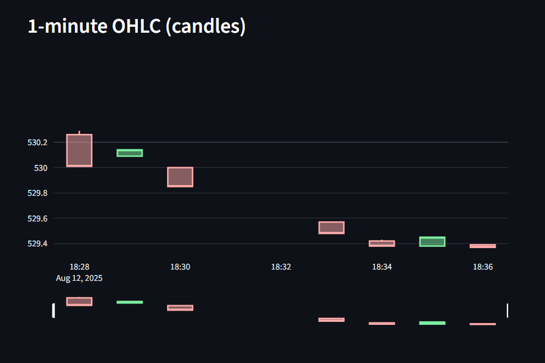
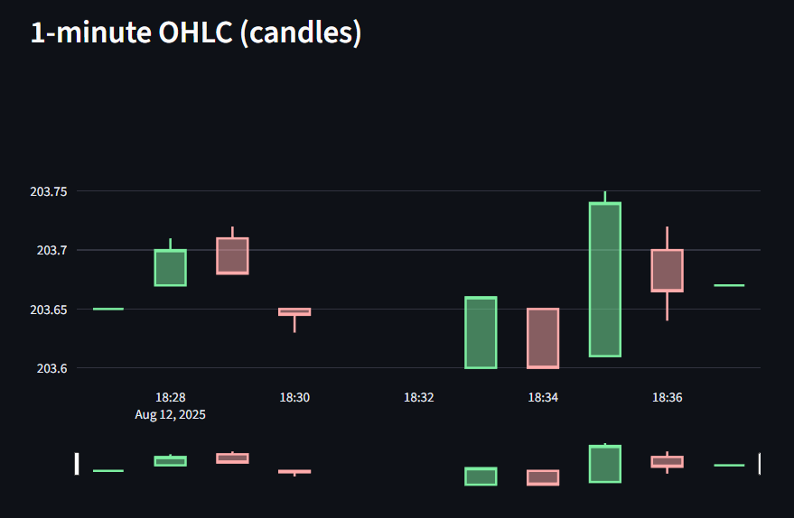

# 📈 Real-Time Financial Data Pipeline with Kafka & Streamlit

A real-time stock trade monitoring pipeline that streams live market data from **Finnhub WebSocket API**, publishes it to **Apache Kafka**, and visualizes it in a **Streamlit dashboard**.

---

## Features
- **Live Trade Data Feed** from [Finnhub.io](https://finnhub.io) WebSocket API.
- **Kafka Producer** sends real-time stock trade ticks to a Kafka topic.
- **Kafka Consumer** reads messages and stores them in memory for dashboard display.
- **Interactive Streamlit Dashboard** with:
  - Live trade table
  - Price line chart
  - 1-minute OHLC candlestick chart
  - Price change alerts
  - Data export (CSV, JSON, PDF)
- **Custom Controls**:
  - Symbol filtering
  - Adjustable refresh rate
  - Pause/Resume streaming
  - Adjustable alert threshold

---

## Project Structure
```
real-time-fin-pipeline/
├─ docker-compose.yml
├─ README.md
├─ requirements.txt
├─ .env
├─ producer/
│ ├─ producer_finnhub.py # Streams Finnhub data to Kafka
│ └─ utils.py
├─ consumer/
│ ├─ kafka_consumer.py # Consumes data from Kafka
├─ frontend/
│ ├─ streamlit_app.py # Interactive dashboard
├─ schemas/
│ └─ trade_tick.avsc
├─ ksql/
│ └─ queries.sql
├─ connectors/
│ ├─ jdbc-sink-postgres.json
│ └─ file-sink.json
├─ grafana/
│ └─ dashboard_sample.json
└─ scripts/
└─ create_topics.sh
```


---

## Prerequisites
- **Docker & Docker Compose**
- **Python 3.9+**
- **Finnhub API Key** (Get free from [finnhub.io](https://finnhub.io/register))
- Basic understanding of Kafka & WebSocket

---

## Installation & Setup

### Clone the Repository
```bash
git clone https://github.com/yourusername/real-time-fin-pipeline.git
cd real-time-fin-pipeline
```


#### Create a .env file in the project root:
```
FINNHUB_KEY=your_finnhub_api_key_here
KAFKA_BROKER=localhost:9092
KAFKA_TOPIC=finnhub
```

#### Start Kafka using Docker
```
docker-compose up -d
```

#### Create Kafka Topic
```
docker exec -it real-timefinancialpipeline-kafka-1 \
  kafka-topics --create --topic finnhub \
  --bootstrap-server localhost:9092 --partitions 1 --replication-factor 1
```

## Running the Pipeline

#### Start the Producer
```
conda activate kafka-finance   # or your Python venv
python producer/producer_finnhub.py
```
#### (Optional) View Kafka Messages in CLI
```
docker exec -it real-timefinancialpipeline-kafka-1 kafka-console-consumer --bootstrap-server localhost:9092 --topic finnhub
```
if you want to see all the data previousely recieved too
```
docker exec -it real-timefinancialpipeline-kafka-1 kafka-console-consumer --bootstrap-server localhost:9092 --topic finnhub --from-beginning
```

#### Start the Streamlit Dashboard
```
streamlit run frontend/streamlit_app.py
```
**Access at: http://localhost:8501**

## 📸 Streamlit Dashboard — Screenshots

Below are screenshots of the running Streamlit dashboard showing live trades, charts and export functionality.

### Overview

ts](assets/d1.png)
*Figure 1 — Main dashboard: live trade table (left), controls & stats (right).*

### Price Chart (AAPL)




### CLI




### OHLC Candles & VWAP




---

## Dashboard Features

- Live Trade Table – view the latest trades in real-time.
- Price Charts – see historical trends for selected symbols.
- Candlestick OHLC Charts – 1-minute aggregation.
- Alerts – price change threshold notifications.
- Export Options – save data as CSV, JSON, or PDF.

## Tech Stack

- Data Source: Finnhub WebSocket API
- Messaging System: Apache Kafka
- Backend Processing: Python (confluent_kafka, websocket-client, pandas)
- Frontend: Streamlit + Plotly
- Deployment: Docker Compose

#### Notes

This pipeline processes real-time data; ensure your internet connection is stable.
The free Finnhub plan may limit API call frequency.
Adjust the list of symbols in producer_finnhub.py to track different stocks(in this I used three symbols  .
